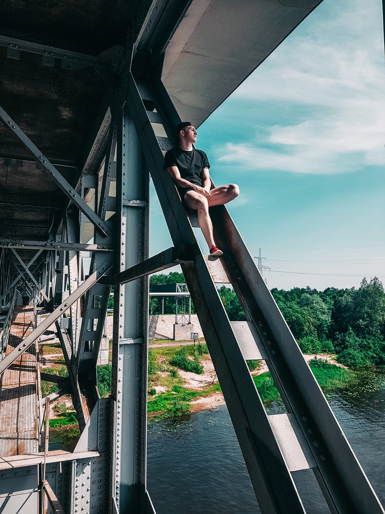
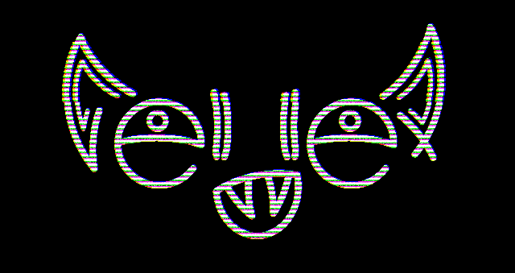

*****
*****
*****




# **Alexander Demeshchenko**  **{ hell_llex }**

## **Contact information:**

**Phone number:** *+375333751903*;

**Email:** *demeshenko333@gmail.com* ;

**Location:** *Belarus, Minsk* ; 

**[GitHub](https://github.com/hell-llex):** *hell-llex* ;

**Discord:** *hell_llex#1516* ;
* **Other link:**
    + **[Instagram](https://www.instagram.com/hell_llex/)**;
    + **[Behance](https://www.behance.net/hell_llex)**;
    + **[Vk](https://vk.com/hell_llex)**
    + **[Linkedin](https://www.linkedin.com/in/александр-демещенко-8bb108220/)**;

*****
*****

## **About Me**
Hi, I'm Alexander Demeshchenko. I am 21 years old, live and work in Minsk.
Work as a sales consultant, but it seems to me that I will not stay in this job for long. I have always been drawn to the field of information technology, so I will make every effort on the way to my goal. Minimally fond of photography.
* Of the good skills , I can mention a couple:
    + Communication skills 9/10;
    + Stress Resistance 9/10;
    + Modesty 9/10;
    + Creativity 7±2/10;

*****
*****

## **Skills**
* Minimum level of knowledge:
    + HTML;
    + CSS;
    + JS;
    + Git/GitHub;
    + After Effects;
* Average level of knowledge:
    + Photoshop;
    + Illustrator;
    + Lightroom;
    + Premiere Pro;
    + Microsoft Office;

*****
*****

## **Code examples**
```
let tongue = document.querySelector(".tongue");

tongue.addEventListener("click", function(){
        line.forEach((elem) => {
            elem.classList.toggle("active");       
        });
        listMenu.forEach((elem) => {
            elem.classList.toggle("active");
        });
    });
```

*****
*****

## **Courses**
*Self-education* & *self-development*.

*****
*****

## **Languages**
+ Russian - **Native**
+ Eanglish - **Basic**

*****
*****



## **hell_llex**

*****
*****